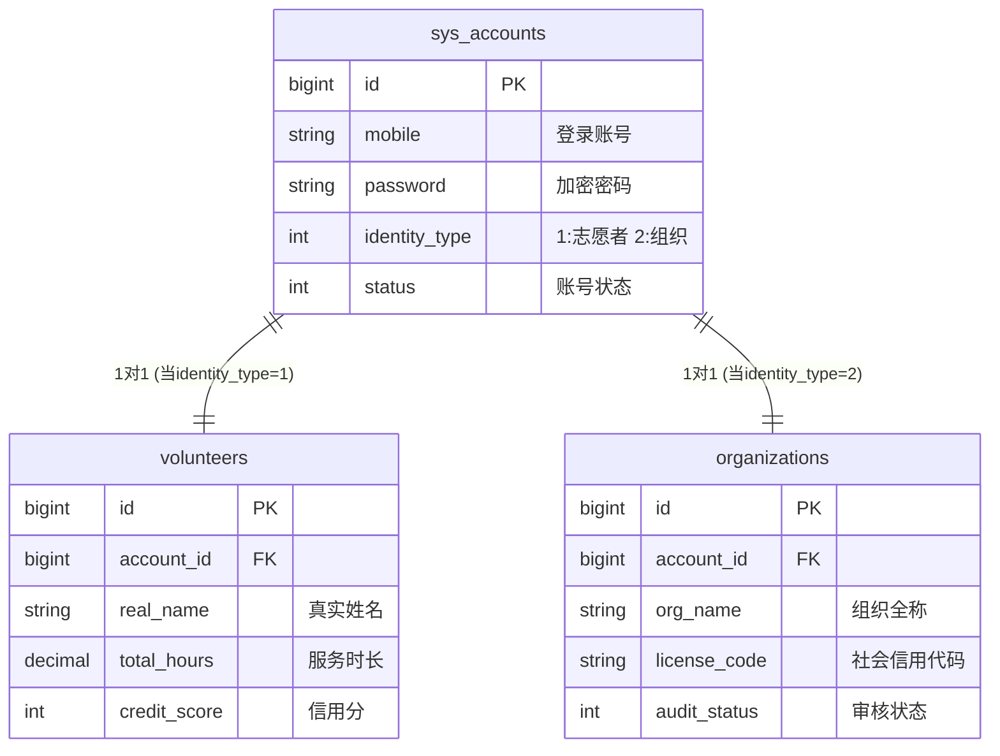

---

# 志愿者服务平台 - 用户体系数据库设计文档

**版本号**：V1.0
**状态**：已审核
**设计目标**：构建可扩展的多身份用户体系（志愿者/组织管理者），实现统一登录与分表存储。

---

## 1. 核心架构设计

### 1.1 设计理念

采用 **“账号主表 + 身份扩展表”** 的架构模式：

* **账号主表 (`sys_accounts`)**：负责存储登录凭证（手机号/密码）和全局状态，是所有用户的唯一入口。
* **身份扩展表**：根据 `identity_type` 区分，志愿者数据存入 `volunteers`，组织数据存入 `organizations`。

### 1.2 实体关系图 (ER Diagram)



---

## 2. 数据库物理模型 (SQL脚本)

> **注意**：请在 MySQL 5.7+ 或 8.0+ 环境下执行。敏感字段（如身份证号）建议在应用层加密后存储。

### 2.1 系统账号表 (sys_accounts)

*所有用户的基础登录表。*

```sql
CREATE TABLE `sys_accounts` (
  `id` BIGINT UNSIGNED NOT NULL AUTO_INCREMENT COMMENT '主键ID',
  `mobile` VARCHAR(20) NOT NULL COMMENT '手机号 (唯一登录标识)',
  `password` VARCHAR(255) NOT NULL COMMENT '加密后的密码',
  `identity_type` TINYINT UNSIGNED NOT NULL COMMENT '身份类型: 1-志愿者, 2-组织管理者',
  
  -- 系统元数据
  `status` TINYINT UNSIGNED DEFAULT '1' COMMENT '账号状态: 0-禁用, 1-正常',
  `created_at` TIMESTAMP NOT NULL DEFAULT CURRENT_TIMESTAMP COMMENT '注册时间',
  `last_login_time` TIMESTAMP NULL COMMENT '最后登录时间',

  PRIMARY KEY (`id`),
  UNIQUE KEY `uk_mobile` (`mobile`) COMMENT '手机号去重索引'
) ENGINE=InnoDB DEFAULT CHARSET=utf8mb4 COMMENT='用户账号主表';

```

### 2.2 志愿者档案表 (volunteers)

*仅存储身份为“志愿者”的业务数据。*

```sql
CREATE TABLE `volunteers` (
  `id` BIGINT UNSIGNED NOT NULL AUTO_INCREMENT,
  `account_id` BIGINT UNSIGNED NOT NULL COMMENT '关联sys_accounts.id',
  
  -- 基础档案
  `real_name` VARCHAR(50) DEFAULT NULL COMMENT '真实姓名',
  `gender` TINYINT UNSIGNED DEFAULT '0' COMMENT '性别: 0-未知, 1-男, 2-女',
  `birthday` DATE DEFAULT NULL COMMENT '出生日期',
  `id_card` VARCHAR(100) DEFAULT NULL COMMENT '身份证号(AES加密存储)',
  `region_code` INT UNSIGNED DEFAULT '0' COMMENT '行政区划代码',
  
  -- 核心统计
  `total_hours` DECIMAL(10, 1) DEFAULT '0.0' COMMENT '累计服务时长(小时)',
  `service_count` INT UNSIGNED DEFAULT '0' COMMENT '累计服务次数',
  `credit_score` INT UNSIGNED DEFAULT '100' COMMENT '信用分(默认100)',
  
  -- 状态
  `audit_status` TINYINT UNSIGNED DEFAULT '0' COMMENT '实名认证状态: 0-未认证, 1-审核中, 2-已通过, 3-驳回',

  PRIMARY KEY (`id`),
  UNIQUE KEY `uk_account` (`account_id`),
  KEY `idx_real_name` (`real_name`),
  KEY `idx_audit_status` (`audit_status`)
) ENGINE=InnoDB DEFAULT CHARSET=utf8mb4 COMMENT='志愿者档案表';

```

### 2.3 组织档案表 (organizations)

*仅存储身份为“组织管理者”的业务数据。*

```sql
CREATE TABLE `organizations` (
  `id` BIGINT UNSIGNED NOT NULL AUTO_INCREMENT,
  `account_id` BIGINT UNSIGNED NOT NULL COMMENT '关联sys_accounts.id',
  
  -- 组织概况
  `org_name` VARCHAR(100) NOT NULL COMMENT '组织全称',
  `license_code` VARCHAR(50) DEFAULT NULL COMMENT '统一社会信用代码/组织机构代码',
  `contact_person` VARCHAR(50) DEFAULT NULL COMMENT '负责人姓名',
  `contact_phone` VARCHAR(20) DEFAULT NULL COMMENT '办公电话',
  `address` VARCHAR(255) DEFAULT NULL COMMENT '办公地址',
  
  -- 状态
  `audit_status` TINYINT UNSIGNED DEFAULT '0' COMMENT '资质审核状态: 0-未提交, 1-审核中, 2-已通过, 3-驳回',
  `updated_at` TIMESTAMP NOT NULL DEFAULT CURRENT_TIMESTAMP ON UPDATE CURRENT_TIMESTAMP,

  PRIMARY KEY (`id`),
  UNIQUE KEY `uk_account` (`account_id`),
  KEY `idx_org_name` (`org_name`)
) ENGINE=InnoDB DEFAULT CHARSET=utf8mb4 COMMENT='组织档案表';

```

---

## 3. 核心业务流程实施规范

### 3.1 注册流程 (Registration)

1. **前端动作**：用户在注册页选择身份（志愿者/组织），提交表单。
2. **后端动作**：
* **Step 1**：开启数据库事务。
* **Step 2**：向 `sys_accounts` 插入数据，获取生成的 `account_id`。
* **Step 3**：根据 `identity_type` 判断：
* 若为 1，向 `volunteers` 表插入 `account_id` 和个人信息。
* 若为 2，向 `organizations` 表插入 `account_id` 和组织信息。


* **Step 4**：提交事务。


### 3.2 登录流程 (Login)

1. **前端动作**：输入手机号、密码。
2. **后端动作**：
* 查询 `sys_accounts` 表，验证密码。
* 验证通过后，检查 `status` 是否为 1（正常）。
* 读取 `identity_type`，并把 `id` (账号ID) 和 `identity_type` 封装进 JWT (Token) 返回给前端。


3. **路由跳转**：前端解析 Token，根据 `identity_type` 决定跳转至“个人中心”或“管理后台”。

---

## 4. 扩展性说明

* **新增角色**：如果未来需要新增“超级管理员”或“政府监管方”，只需在 `sys_accounts` 的 `identity_type` 增加枚举值，并新建一张 `sys_admins` 表即可，无需修改现有表结构。
* **数据隔离**：统计志愿者服务时长时，只需查询 `volunteers` 表，不会受到组织数据的干扰，查询效率高。